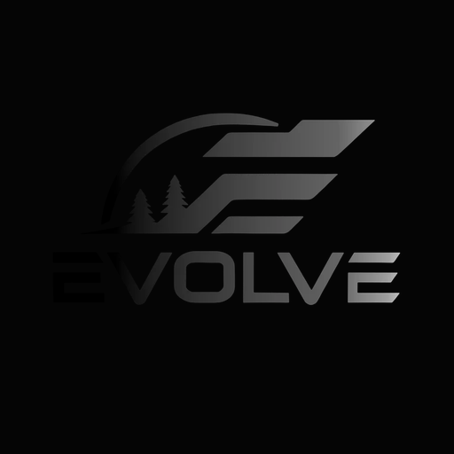

<p align="center">
  
</p>

<h1 align="center">Evolve Field App</h1>

<p align="center">
  <em>The back office of a blasting company, run on autopilot — now with a field safety system.</em><br>
  Crew tap a button in the truck. The system files the books, prices the quotes, runs the morning safety assessment, audits itself, and backs itself up — while they drive to the next job.
</p>

<p align="center">
  
  
  
  
  
  
  
</p>

<p align="center">
  <strong>$0/month · Google Apps Script + a spreadsheet + a scheduled AI · no servers, no SaaS</strong>
</p>

---

## TL;DR

A mobile-first field app for an abrasive-blasting crew who aren't technical and shouldn't have to be. They sign in with a name and a 4-digit PIN and tap one big button:

- **Log something** — Receipt, Job Photo, Before/After, Lead, Customer, Quote, Inventory, Price, Job Actuals, or "just say what it is."
- **Start FLHA** — a phone-first **Field Level Hazard Assessment** the crew completes before work starts, with a verified per-worker sign-off.
- **Report a Hazard** — a one-screen escalation that emails management immediately.

Everything they capture lands in one safe **Inbox** tab of the company's Google Sheets "Ops Workbook." Then **two brains take over:**

1. A **scheduled Claude agent** reads the inbox a few times a day and does the part nobody wants to do — reads the receipt and files it under Expenses; turns a field note into a Lead with a follow-up; prices a quote, generates the branded PDF, and emails it; and audits the whole workbook for things that slipped.
2. A **server-side automation layer** running on Google's own triggers (no PC required) sends the morning digest, sweeps the money loop three times a day, turns email replies into to-dos, mines spend for daily insights, and **backs up the entire workbook every three days** into a copy that can't be deleted by accident.

And now a **third pillar — safety** — logs every FLHA and hazard report to the workbook, stores a branded PDF to Drive, and emails the owners, with signatures that are cryptographically attributable and can't be back-dated.

It is the difference between *"we have a spreadsheet"* and *"the spreadsheet runs the business — safely."*

---

## What this actually is

Most small trades businesses die by a thousand un-logged receipts and one un-documented incident. The owner is on a ladder, not at a desk. Data entry — and safety paperwork — is the tax you pay for knowing whether you made money and whether you're covered, and nobody pays it on time.

This kills the tax.

- **Capture is one tap and a photo.** No training, no "fields." Not sure where something goes? Hit **Quick Capture**, say it in plain words, and the AI figures it out.
- **Safety is built in, not bolted on.** The morning FLHA is mostly tappable buttons; it can't be submitted without real hazards, controls, a site-specific note, the equipment check, and a signature. A hazard can be escalated to management in about ten seconds.
- **The crew can't break the books.** Every capture lands in a safe staging **Inbox**; the app only ever *appends rows or sets cells* — it never edits the fragile matrix/legend/scorecard layouts. Heavy structured filing runs through the scheduled brains, not the crew's phone.
- **It keeps running with the PC off.** Digests, sweeps, insight generation, backups, and the safety pipeline live on Google's time-driven triggers.
- **It runs on what the business already pays for.** Google Workspace + a domain. No new subscriptions, no server, no per-seat SaaS.

> The design goal was never "an app." It was: *the owner should be able to ignore the back office for a week and come back to a clean, current, correctly-categorized set of books — a documented safety record for every shift — and never lose a thing.*

---

## How it runs the business on autopilot

```
  FIELD CREW (phone)            SAFE STAGING            THE THREE PILLARS                 THE BOOKS
 ┌─────────────────────┐      ┌──────────────┐    ┌──────────────────────────┐     ┌──────────────────┐
 │  Evolve Field App    │      │  📥 App Inbox │   │ ① Scheduled Claude agent │     │  Quotes           │
 │  name + 4-digit PIN  │ tap  │  (append-only │   │    files · quotes · audit │ ───▶│  Customers · Leads │
 │                      │ ───▶ │   staging)    │──▶│                          │     │  Dispatch          │
 │  • Log something     │ photo│              │    │ ② Apps Script autonomy   │     │  Expenses          │
 │  • 🦺 Start FLHA      │      │  👥 App Users │   │    (Google triggers,     │     │  Job P&L           │
 │  • ⚠️ Report Hazard   │      │  🗒 App Log   │   │     PC-off)              │     │  Action Items …    │
 └─────────┬───────────┘       └──────┬───────┘    │ ③ Safety pipeline        │     ├──────────────────┤
           │                          │            │    FLHA + hazard escal.  │     │  🦺 FLHA           │
           │        photos            ▼            └───────────┬──────────────┘     │  ⚠️ Hazard Reports │
           └───────────────▶ ┌──────────────┐                 │                    └─────────┬────────┘
                             │ Google Drive  │  branded PDFs +  │  emails digests, quotes,     │
                             │ photos · PDFs │  insights + "you │  FLHA PDFs, hazard alerts  ◀─┘
                             └──────────────┘  forgot to X" ───▶ OWNERS' INBOX
```

The crew side is dumb on purpose. The intelligence lives in the scheduled layers, where it's cheap, auditable, and improvable without ever touching the thing in the crew's hands.

---

## 🦺 The safety system (Alberta OHS–aligned)

The newest pillar. A blasting crew works with respirable silica, compressed air, and — on older substrates — lead paint. Safety documentation isn't optional, and it can't be a chore or it won't get done. So it was built to be *fast, conclusive, and legally defensible.*

**Field Level Hazard Assessment (FLHA)** — completed at the job or shop before work starts:

- **Mostly taps.** Location, date, start time, field/shop; then tappable chips for **weather, 20+ pre-loaded blasting hazards** (respirable dust — the media is silica-free — and lead paint first), **controls in the hierarchy order** (eliminate → substitute → engineer → administrate → PPE), and **PPE**.
- **A thorough pre-work checklist** — a **27-point Yes / No / N/A** checklist across *Equipment & pressure* (whip checks on **every** connection, o-rings, hose routing so a breakaway can't whip anyone, compressor filters/oil/fuel, generator, line-leak checks, deadman valves, couplings), *Site & containment* (blast radius secured, delineation/pylons/signage, tarps, masking, media contained, spray area watched, overhead lines, public control, wind, spill kit), and *Crew readiness* (water/hydration, first aid, extinguisher, SDS). One-tap "All Yes" per section, flip anything that isn't; a live counter and any "No" is flagged.
- **Young/new-worker block** — flags a young or new worker on the crew and records the competent worker supervising them (Alberta Act §3(2)).
- **Risk with a hard stop.** Low / Medium / **High = STOP** until a supervisor approves.
- **Can't be a copy-paste.** Submission is blocked without at least one hazard, one control, a **required site-specific note**, the full equipment check, and a signature — the "checkbox exercise" an OHS officer looks for is designed out.
- **Add site photos** — containment, hazards, setup — in one tap.
- **Verified per-worker sign-off.** Each worker signs with *their own PIN*. The server verifies it and returns an **HMAC signature stamped with a server timestamp**, so a signature is genuinely that worker's, can't be forged from the phone, and can't be back-dated. Two, three, or more sign on the crew-lead's phone. By signing, each worker attests *"I understand the hazards, I'm trained for my task, I have the proper PPE"* — the artifact that satisfies the young/new-worker training duty.

**Report a Hazard** — a separate one-screen fast lane: severity (Low → Critical), hazard type, what's going on, location, optional photo → **emails both owners immediately** and logs to a Hazard Reports tab. A way to make management aware of a problem in seconds.

**On submit, every FLHA:** logs one row to the `🦺 FLHA` tab (with each signer + timestamp as proof), renders a **branded, invoice-grade PDF** and stores it to Drive, and emails it to the owners — reusing the same mailer the morning digest uses.

> Aligned to the **Alberta OHS Act, Regulation and Code** — Part 2 §7–10 (assess before work, involve workers, control by hierarchy), Act §3(2) (train young/new workers before hazardous work), and Part 4 §39 (abrasive-blasting silica). Records are timestamped server-side and built to be retained ≥ 5 years (10+ for silica/lead exposure).

---

## Feature tour

| Area | What it does |
|---|---|
| **Capture** | One-tap logging of receipts, job photos, before/after, leads, customers, quotes, inventory, price logs, job actuals, feature requests, and free-form "quick capture." Offline outbox so nothing is ever lost. |
| **Receipt OCR** | Two free OCR engines (Google Drive native, on-device Tesseract fallback) auto-fill vendor/date/total from a photo — no paid API. A robust money parser handles `$1,234.56`, European `1.234,56`, and space-grouped totals. |
| **The Claude agent** | Reads the inbox on a schedule, files each item to the right tab/columns, builds and emails branded quotes, raises "you forgot to invoice this" alerts, and audits the workbook. |
| **Server-side autonomy** | Morning digest, money-loop sweeps (3×/day), email-reply → to-do capture, a daily spend-insight engine, and a 3-day workbook backup — all on Google triggers, PC or no PC. |
| **🦺 Safety** | FLHA with verified multi-worker sign-off + branded PDF; one-tap hazard escalation to management. |
| **Financial safety gate** | Ambiguous or unreadable receipt totals are *held out* of Expenses/P&L until a human confirms — a wrong number never silently enters the books. |

---

## Security model

This is a real app with an auth system and user logins, so security is a first-class concern.

- **No secrets in source.** Every credential — the router secret, the deployment secret, the script ID, the spreadsheet and Drive IDs — lives in Google **Script Properties**, deployment config, or the workbook itself, never in committed code. This repository ships **only placeholders** (`YOUR_SPREADSHEET_ID`, `YOUR_ROUTER_SECRET`, `manager@yourcompany.com`, …). See [`DEPLOY.md`](DEPLOY.md) to wire in your own.
- **User logins never touch the repo.** Names and 4-digit PINs live in a `👥 App Users` tab in the private workbook — not in code. There are no real credentials anywhere in this repository.
- **Attributable, tamper-evident sign-off.** FLHA signatures are HMAC-signed with a server-only secret and stamped with a server timestamp; they can't be forged client-side or back-dated.
- **Least-corruptible by design.** The crew app only appends rows / sets single cells; the fragile financial layouts are only ever written by the audited, scheduled layers.
- **Brute-force throttling** on login and sign-off, **30-day HMAC session tokens**, and a **secret-gated** server API for the automation.

---

## Data integrity & audit

The books are only worth what they're accurate to. The codebase includes a hardening layer with a unit-tested money parser, a financial gate that quarantines untrustworthy totals, receipt de-duplication keyed on a submission ID, and canonical vendor merging. The system is periodically audited end-to-end (parsing, filing paths, trigger hygiene, duplicate detection) and fixes are verified against a regression battery before deploy.

---

## Tech stack

- **Runtime:** Google Apps Script (V8) — web app + time-driven triggers
- **Data:** Google Sheets (Ops Workbook) + Google Drive (photos, receipts, quote & FLHA PDFs)
- **Frontend:** a single self-contained `Index.html` — vanilla JS, installable to the home screen, offline-capable (IndexedDB outbox), branded to the company site
- **Intelligence:** a scheduled Claude agent (via CLI / automation) for filing, pricing, and auditing
- **PDF/OCR/email:** all native Apps Script (`getAs('application/pdf')`, Drive OCR, `MailApp`) — zero third-party services

---

## Repository layout

```
Index.html            The entire field app — UI + logic (login, capture, FLHA, hazard, offline outbox)
Code.gs               Web-app entry, auth (name+PIN → HMAC tokens), capture API, the secret-gated router API
AutoServer.gs         Server-side autonomy: morning digest, sweeps, reply monitor, filer, business brain
Safety.gs             FLHA + hazard escalation: verified sign-off, branded PDF, sheet + Drive + email
Filing.gs             Deterministic inbox→tab routing and per-category filers
Hardening.gs          Money parser, financial gate, idempotency, receipt-log upsert (unit-tested)
Intelligence.gs       GST separation, Job P&L, cross-tab insights, price watch, data-quality sweep
DriveIntake.gs        Hourly OCR of loose Drive receipts → inbox → filer
ReceiptOps.gs         Receipt Log, router-health watch, discrepancy report
Backups.gs            3-day full-workbook backups into a protected folder
DigestV2/V3.gs        Morning-digest builders
OcrFill.gs            Free in-app receipt OCR (Drive + Tesseract)
appsscript.json       Manifest (scopes, web-app config)
DEPLOY.md             10-minute deploy guide
claude-router-task.md The scheduled-agent playbook (tab column maps, actions)
WORKBOOK-SCHEMA.md    The workbook's tab/column structure
```

---

## Deploy

Full walkthrough in **[`DEPLOY.md`](DEPLOY.md)** — create the Apps Script project, paste the files, fill in your own IDs, run `setup()` + `setupSafety()`, deploy as a web app, add your crew. About ten minutes.

---

## Roadmap

The system is built to grow — new modules are added over time without touching the crew's phone. Planned and in-progress:

- **Near-instant in-app quoting** — server-side quote build + PDF, dropping the desktop step entirely.
- **Deeper Job P&L** — join Dispatch ↔ Quotes ↔ Receipt Log for true per-job margin and $/sq ft.
- **Safety analytics** — FLHA/near-miss trends, leading indicators, and a monthly safety summary to the owners.
- **Crew competency & training records** — tie each worker's tickets/training to their sign-off for a complete young-worker file.
- **Fuzzy vendor matching** and continued receipt-parser hardening.
- **Configurable, rebrandable OSS template** — so any small trades business can stand up the same back office.
- **Second brain (future / backlog):** an **Obsidian-based knowledge vault** that mirrors the ops data and documentation into a linked, searchable "second brain" for the business — Maps of Content, dashboards, and AI-readable context. *Planned for a later iteration.*

---

## Design principles

1. **The crew's tool is dumb on purpose.** Intelligence belongs in the scheduled, auditable layers.
2. **Never lose a capture.** Offline outbox, idempotent submits, held-not-dropped bad totals.
3. **Never corrupt the books.** Append-only from the phone; structured writes are audited.
4. **Safety must be faster than skipping it.** If the FLHA takes longer than not doing it, it won't get done.
5. **$0 infrastructure.** If it needs a server or a subscription, find another way.

---

## Built by

**Matt Haynes** — [kr8tiv.io](https://kr8tiv.io) / [kr8tiv.ai](https://kr8tiv.ai). Product, architecture, and build.
Developed with AI pair-programming (Claude). Client: Evolve Eco Blasting (Edmonton & Greater Alberta).

## License

MIT — see [`LICENSE`](LICENSE). Use it, learn from it, build your own back office with it.
